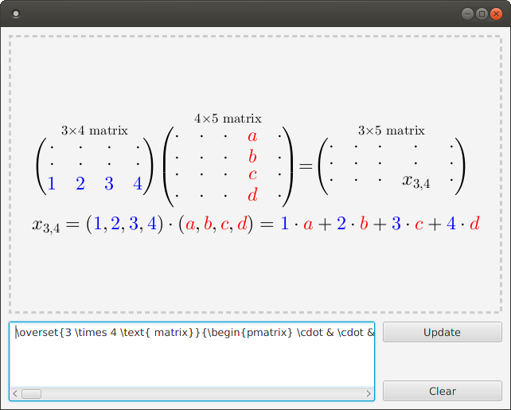

# LatexView

[](https://travis-ci.com/egormkn/latexview) [](https://repo.maven.apache.org/maven2/io/github/egormkn/latexview/) [](https://oss.sonatype.org/content/repositories/releases/io/github/egormkn/latexview/)

LatexView is a custom JavaFX component that renders LaTeX text and formulas using [JLatexMath](https://github.com/opencollab/jlatexmath) library.



Use [Demo](src/test/demo/Demo.java) application to test LaTeX rendering.

See [JLatexMath](https://github.com/opencollab/jlatexmath) documentation for supported LaTeX features.

## Installation

### Maven dependency

```xml
<dependency>
    <groupId>io.github.egormkn</groupId>
    <artifactId>latexview</artifactId>
    <version>0.6.0</version>
</dependency>
```

## Usage

### With FXML

See [ExampleFXML.java](src/test/java/ExampleFXML.java)

```fxml
<LatexView formula="\\LaTeX" size="30"/>

<LatexView size="20">
    \overset{\text{Lorenz system}}{
        \begin{cases}
        \frac { \partial \vec v }{\partial t} + \left( \vec v \nabla \right) \vec v = -\frac {\nabla p}{\rho} + \nu \nabla ^2 \vec v + \vec g \\
        \frac { \partial \rho }{\partial t} + \nabla \cdot \left( \rho \vec v \right) = 0 \\
        \frac { \partial T }{\partial t} + \nabla \cdot \left( T \vec v \right) = \chi \nabla ^2 T \\
        \rho = \rho_0 \left( 1 - \gamma \left( T - T_0 \right) \right)
        \end{cases}
    }
</LatexView>
```

### Without FXML

See [ExampleJFX.java](src/test/java/ExampleJFX.java)

```java
LatexView latex = new LatexView("\\LaTeX");
latex.setSize(30);

VBox vbox = new VBox(latex);
Scene scene = new Scene(vbox, 640, 480);
```

## License

This project is released under the GPLv3 license.
For more details, take a look at the [LICENSE](LICENSE) file.
